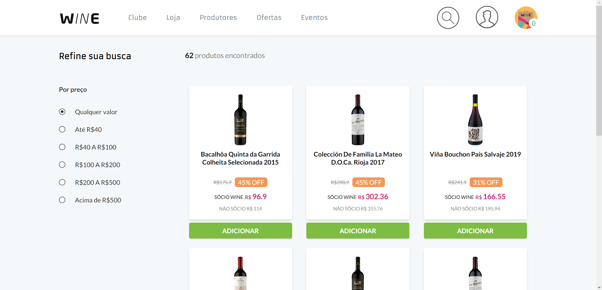

# Desafio Wine.com.br

Esse é um projeto com o objetivo de concluir o desafio da "Wine", simulando uma loja com carrinho e consumindo api para obter os produtos

## Tabela de conteudo

- [Visão geral](#visao-geral)
  - [Descrição](#descrição)
  - [Screenshot](#screenshot)
  - [Links](#links)
  - [Como rodar o projeto local](#como-rodar)
- [Tecnologias](#tecnologias)
  - [Construido com](#construido-com)

## Visao-geral

### Descrição

- Uma loja onde consome uma api para obter os produtos com um carrinho com localStorage

### Screenshot

### Links

- Live Site URL: [Vercel live](https://winechallenge.vercel.app)
- Desafio: [Wine](https://github.com/winecombr/frontend-challenge)

### Como rodar
- Faça um "git clone" do projeto para uma pasta local
- Rode o comando "npm install" para instalar dependencias do projeto
- Para rodar o servidor local utilize "npm run dev" 
- O projeto será aberto no em "http://localhost:3000"

## Tecnologias

### Construido com

- NextJS
- React
- TypeScript
- Tailwind CSS
- HTML
- Axios
- LocalStorage